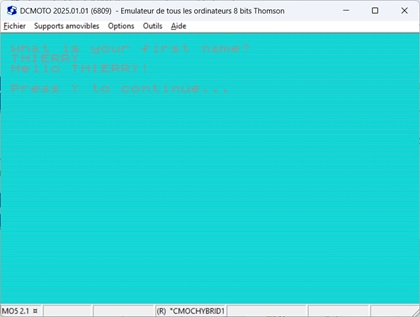
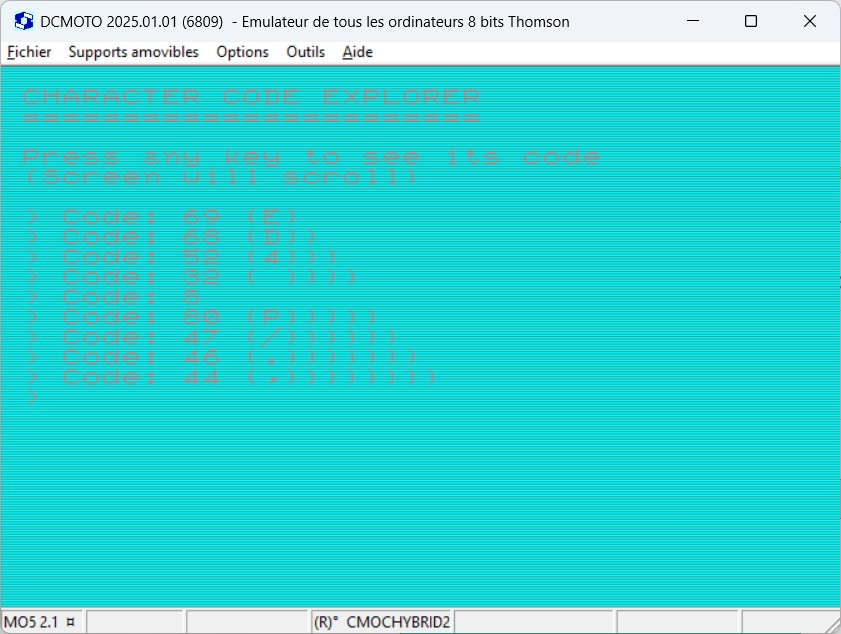
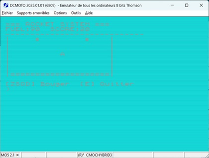

# Thomson MO5 C Examples (CMOC-based)

This repository contains a collection of **C language examples for the Thomson MO5**, built with the **CMOC compiler** and related tools.

The project explores different approaches to C development on the MO5, ranging from pure CMOC usage to hybrid and fully home-made C libraries.

All projects are built using **Makefiles**, available at multiple levels of the repository.

---

## Prerequisites

To build and run the programs, you will need:

- **DCMOTO** emulator  
  http://dcmoto.free.fr/emulateur/index.html

- **LWTOOLS** (6809/6309 cross-development tools)  
  https://www.lwtools.ca/

- **CMOC** (Motorola 6809 C compiler)  
  http://gvlsywt.cluster051.hosting.ovh.net/dev/cmoc.html

⚠️ Note: Some of these websites use HTTP instead of HTTPS.  
They are well-known and trusted resources in the retro-computing community.

---

## Project Structure

```text
.
├── Makefile                  # Root Makefile (builds everything)
├── tools/
│   └── BootFloppyDisk/       # BootFloppyDisk tools
├── cmoc-native/
│   ├── Makefile              # Builds all samples
│   ├── key_reader/
│   │   ├── Makefile
│   │   └── src/
│   │       └── main.c
│   └── what_is_your_name/
│       ├── Makefile
│       └── src/
│           └── main.c
├── cmoc-hybrid/
│   ├── Makefile              # Builds all samples
│   ├── libs/
│   ├── key_reader/
│   │   ├── Makefile
│   │   └── src/
│   │       └── main.c
│   ├── what_is_your_name/
│   │   ├── Makefile
│   │   └── src/
│   │       └── main.c
│   └── fusee/
│       ├── Makefile
│       └── src/
│           └── main.c
├── home-made/
│   ├── Makefile              # Builds all samples
│   ├── libs/
│   ├── key_reader/
│   │   ├── Makefile
│   │   └── src/
│   │       └── main.c
│   └── what_is_your_name/
│       ├── Makefile
│       └── src/
│           └── main.c
└── graphic/
    ├── Makefile              # Builds all samples
    ├── libs/
    ├── display_text/
    │   ├── Makefile
    │   └── src/
    │       └── main.c
    └── hello_word/
        ├── Makefile
        └── src/
            └── main.c
```

---

## BootFloppyDisk Installation

The root Makefile can automatically install BootFloppyDisk, which is required to generate bootable disk images for the Thomson MO5.

To install the tools:

```bash
make install
```

This will:

- Clone the BootFloppyDisk repository
- Build the required tools
- Generate BOOTMO.BIN, used during disk image creation

---

## Building the Projects

### Build everything (root level)

```bash
make
```

---

### Build per directory

Each main directory contains its own Makefile, allowing you to build only the samples inside that directory.

Example:

```bash
cd cmoc-native
make
```

---

### Build a single sample

Each sample directory has its own Makefile and a single entry point located in src/main.c.

Example:

```bash
cd cmoc-native/key_reader
make
```

---

### Clean build files

Clean everything from the root:

```bash
make clean
```

Or clean at directory or sample level using the corresponding Makefile.

---

## Directory Overview

### cmoc-native

- Uses only cmoc.h
- No standard C libraries
- Pure CMOC examples

---

### cmoc-hybrid

- Uses cmoc.h
- Adds custom libraries to extend missing C features
- Partial implementations of stdio.h and ctype.h

Libraries are located in cmoc-hybrid/libs.

---

### home-made

- Does not use cmoc.h
- Fully home-made implementations of stdio.h, ctype.h and string.h

Libraries are located in home-made/libs.

---

### graphic

- Use cmoc.h
- Explore graphic features

---

## Sample Projects

Each directory (cmoc-native, cmoc-hybrid, home-made) contains the same two sample projects.

### what_is_your_name — Name Greeting Program

- Prompts the user to enter their name
- Displays:

Hello [entered name]



---

### key_reader — Key Code Display Program

- Waits for a key press
- Displays the character code of the pressed key



---

### fusee (cmoc-hybrid only) — text rocket game

- move a rocket (A caracter)
- fuel management



---

## Goals of This Repository

- Explore C programming on the Thomson MO5
- Compare multiple development approaches:
  - CMOC-only
  - CMOC + extended libraries
  - Fully custom C runtime
- Provide small, clear, and educational examples

---

## References

Detailed explanations about the development environment and toolchain setup used in this project are available on my blog:

- Toolchain and environment setup (DCMOTO, LWTOOLS, CMOC, BootFloppyDisk):  
  https://thlg057.github.io/mo5-blog/en/days/day-1-setup/

This article explains step by step how to install and configure the tools required to build and run the examples provided in this repository.

---

## Credits

- BootFloppyDisk tools by OlivierP-To8
- Thomson MO5 community and documentation
